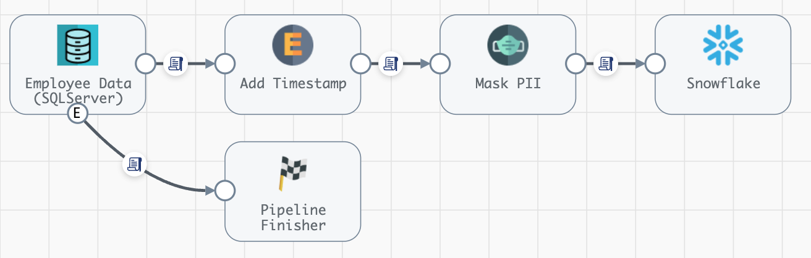

## Run StreamSets Job on an Ephemeral Engine on Kubernetes
This project provides an example of how to use the [StreamSets Platform SDK](https://docs.streamsets.com/platform-sdk/latest/index.html) to automate the process of running a StreamSets Job on a "just-in-time" engine deployment on Kubernetes. 

This deployment pattern can help minimize the expense of long-running and under-utilized StreamSets engines. 

The Python script in this project performs the following steps:

- Clones a StreamSets Kubernetes Deployment from a pre-existing template and assigns a unique engine label to the new deployment.

- Starts the deployment which causes an engine to be deployed on Kubernetes with the unique label.

- Updates a Job with the unique engine label.

- Starts the Job, which will run on the just deployed engine.

- Waits for the Job to complete.

- Tears down the engine and deletes the Deployment.

This example assumes the use of [WebSocket Tunneling](https://docs.streamsets.com/portal/platform-controlhub/controlhub/UserGuide/Engines/Communication.html#concept_hbg_fq3_34b), which simplifies the process of cloning a deployment. If you must use [Direct Engine Rest APIs](https://docs.streamsets.com/portal/platform-controlhub/controlhub/UserGuide/Engines/Communication.html#concept_dt2_hq3_34b) instead, the same "just in time" deployment pattern can be used, but with the added requirement of configuring some form of ingress for the cloned deployment. See the project [here](https://github.com/streamsets/streamsets-sdk-k8s-deployment-with-ingress/blob/main/README.md) for an example of using the StreamSets SDK to automate deploying engines on Kubernetes with Direct Enginen REST APIs.


## Prerequisites

- A Python 3.9+ environment with the StreamSets Platform SDK v6.0+ module installed. This example was tested using Python 3.11.5 and StreamSets SDK v6.4.

- StreamSets [API Credentials](https://docs.streamsets.com/portal/platform-controlhub/controlhub/UserGuide/OrganizationSecurity/APICredentials_title.html#concept_vpm_p32_qqb)

- An active StreamSets [Kubernetes Environment](https://docs.streamsets.com/portal/platform-controlhub/controlhub/UserGuide/Environments/Kubernetes.html#concept_l1w_h4g_2vb) with an online Kubernetes Agent. 

- A pre-existing StreamSets [Kubernetes Deployment](https://docs.streamsets.com/portal/platform-controlhub/controlhub/UserGuide/Deployments/Kubernetes.html#concept_ec3_cqg_hvb) that this project will clone at runtime (see below for details).


## Running the Example


- Clone this project to your local machine

- Create a file named <code>sdk-env.sh</code> with your API credentials in the project's [private](private) directory as quoted strings with no spaces, like this:

	```
	export CRED_ID="esdgew……193d2"
	export CRED_TOKEN="eyJ0…………J9."
	```

- Select a Job to run. For example, I'll use a Job that performs a batch load from SQLServer to Snowflake, with a pipeline like this:



- Create but do not start a Kubernetes Deployment to serve as a template.  Make sure the deployment includes the stage libraries necessary to run the pipeline, in my case, the JDBC and Snowflake stage libraries. Typically the number of instances should be set to one, in order to deploy a single engine, and the engine CPU and memory sizing should reflect the need to run only a single pipeline at a time if that is the use of this pattern.

In my example, I'll use a Deployment named <code>deployment-template</code>:


- Execute the project's top level shell script using a command of the form:

```$ ./run-streamsets-job-on-ephemeral-engine-on-k8s.sh <deployment_to_clone_id> <new_deployment_name> <job_id> <engine_label>"```

For example, I'll specify the ID of my template deployment, the name of the new deployment I want to create ("ephemeral-1"), the JOB ID, and a globally unique engine label ("ephemeral-label") which will bind the Job to the engine:

```$./run-streamsets-job-on-ephemeral-engine-on-k8s.sh 6895a7c5-2fad-465c-b132-d0a3adac6e47:8030c2e9-1a39-11ec-a5fe-97c8d4369386 ephemeral-1 1aee8d54-e2cb-4edd-9f6e-f7dc95f370be:8030c2e9-1a39-11ec-a5fe-97c8d4369386 label-1"
```


You should see output like this: