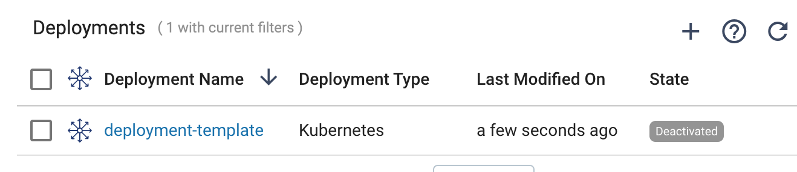
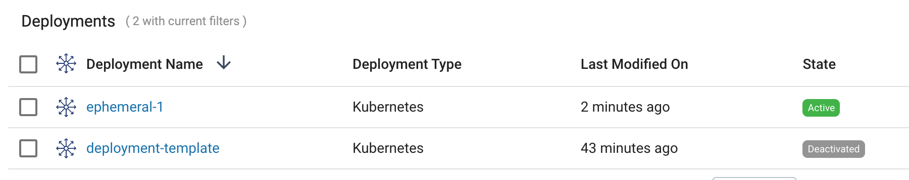
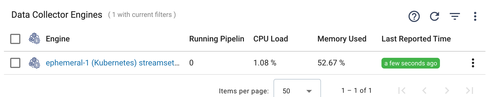
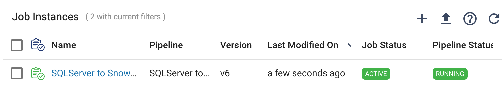
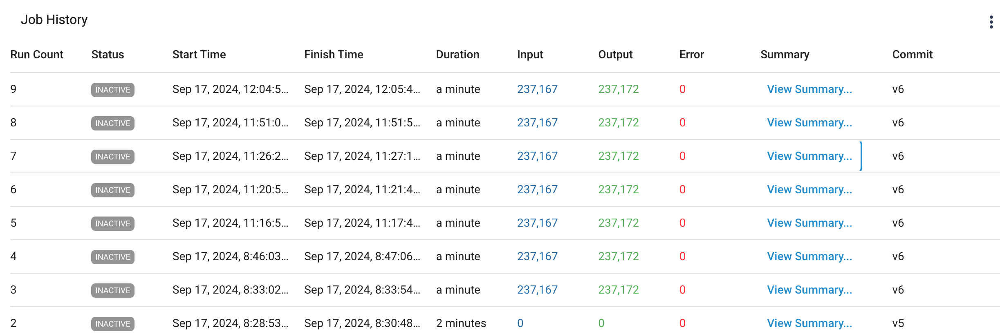
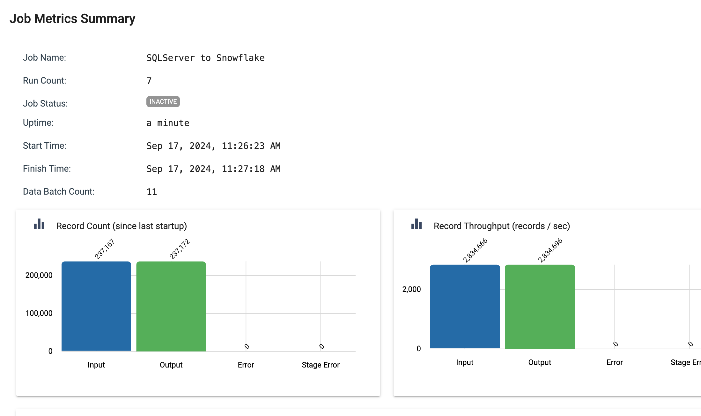

## Run StreamSets Job on an Ephemeral Engine on Kubernetes
This project provides an example of how to use the [StreamSets Platform SDK](https://docs.streamsets.com/platform-sdk/latest/index.html) to automate the process of running a StreamSets Job on a "just-in-time" engine deployment on Kubernetes. 

This deployment pattern can help minimize the expense of long-running and under-utilized StreamSets engines. 

The Python script in this project performs the following steps:

- Clones a StreamSets Kubernetes Deployment from a pre-existing template and assigns a unique engine label to the new deployment.

- Starts the deployment which causes an engine to be deployed on Kubernetes with the unique label.

- Updates a Job with the unique engine label.

- Starts the Job, which will run on the just deployed engine.

- Waits for the Job to complete.

- Tears down the engine and deletes the Deployment.

This example assumes the use of [WebSocket Tunneling](https://docs.streamsets.com/portal/platform-controlhub/controlhub/UserGuide/Engines/Communication.html#concept_hbg_fq3_34b), which simplifies the process of cloning a deployment. If you must use [Direct Engine Rest APIs](https://docs.streamsets.com/portal/platform-controlhub/controlhub/UserGuide/Engines/Communication.html#concept_dt2_hq3_34b) instead, the same "just in time" deployment pattern can be used, but with the added requirement of configuring ingress for the cloned deployment. See the project [here](https://github.com/streamsets/streamsets-sdk-k8s-deployment-with-ingress/blob/main/README.md) for an example of using the StreamSets SDK to automate deploying engines on Kubernetes with Direct Enginen REST APIs.


## Prerequisites

- A Python 3.9+ environment with the StreamSets Platform SDK v6.0+ module installed. This example was tested using Python 3.11.5 and StreamSets SDK v6.4.

- StreamSets [API Credentials](https://docs.streamsets.com/portal/platform-controlhub/controlhub/UserGuide/OrganizationSecurity/APICredentials_title.html#concept_vpm_p32_qqb)

- An active StreamSets [Kubernetes Environment](https://docs.streamsets.com/portal/platform-controlhub/controlhub/UserGuide/Environments/Kubernetes.html#concept_l1w_h4g_2vb) with an online Kubernetes Agent. 

- A StreamSets [Kubernetes Deployment](https://docs.streamsets.com/portal/platform-controlhub/controlhub/UserGuide/Deployments/Kubernetes.html#concept_ec3_cqg_hvb) that this project will clone at runtime (see below for details).


## Running the Example


- Clone this project to your local machine

- Create a file named <code>sdk-env.sh</code> with your API credentials in the project's [private](private) directory as quoted strings with no spaces, like this:

	```
	export CRED_ID="esdgew……193d2"
	export CRED_TOKEN="eyJ0…………J9."
	```

- Select a Job to run. For example, I'll use a Job that performs a batch load from SQLServer to Snowflake, with a pipeline like this:


- Select an existing or create a new StreamSets Kubernetes Deployment to serve as a template. Make sure the deployment includes the stage libraries necessary to run the pipeline, in my case, the JDBC and Snowflake stage libraries. Typically, the deployment's "desired instances" should be set to one, with autoscaling disabled, in order to deploy a single engine, and the engine's CPU and memory sizing should reflect the need to run only a single pipeline at a time for use with this pattern.

In my example, I'll use a Deployment named <code>deployment-template</code>:




- Execute the project's top level shell script using a command of the form:

<code>$ ./run-streamsets-job-on-ephemeral-engine-on-k8s.sh <deployment_to_clone_id> <new_deployment_name> <job_id> <engine_label></code>

For example, I'll specify the ID of my template deployment, the name of the new deployment I want to create ("ephemeral-1"), the Job ID, and a globally unique engine label ("ephemeral-label-1") which will bind the Job to the engine:

<code>$ ./run-streamsets-job-on-ephemeral-engine-on-k8s.sh \
 19dc63bb-5911-4e9e-b71c-8a6d6e29a9c7:8030c2e9-1a39-11ec-a5fe-97c8d4369386 \
 ephemeral-1 \
 9caf20bc-dd88-4665-8ef2-10140e7a5417:8030c2e9-1a39-11ec-a5fe-97c8d4369386 \
 ephemeral-label-1</code>


As the script runs you should see a new deployment enter the Activating state:


After a minute or two it should transition to an Active state:



Once the deployment is Active, you should see a new Engine has registered with Control Hub:



And then the Job should start:



When the Job completes, the engine and the deployment will be deleted.

Note that even though the engine and deployment are deleted, the Job's history still has full metrics of the run:






Here is the command-line output from running the script:

```
% ./run-streamsets-job-on-ephemeral-engine-on-k8s.sh \
 19dc63bb-5911-4e9e-b71c-8a6d6e29a9c7:8030c2e9-1a39-11ec-a5fe-97c8d4369386 \
 ephemeral-1 \
 9caf20bc-dd88-4665-8ef2-10140e7a5417:8030c2e9-1a39-11ec-a5fe-97c8d4369386 \
 ephemeral-label-1
2024-09-17 11:25:24 ----
2024-09-17 11:25:24 Run StreamSets Job on Ephemeral Kubernetes Deployment
2024-09-17 11:25:24 ----
2024-09-17 11:25:24 Source Deployment's ID: 19dc63bb-5911-4e9e-b71c-8a6d6e29a9c7:8030c2e9-1a39-11ec-a5fe-97c8d4369386
2024-09-17 11:25:24 New Deployment's name: ephemeral-1
2024-09-17 11:25:24 Job ID: 9caf20bc-dd88-4665-8ef2-10140e7a5417:8030c2e9-1a39-11ec-a5fe-97c8d4369386
2024-09-17 11:25:24 Engine Label: ephemeral-label-1
2024-09-17 11:25:24 ----
2024-09-17 11:25:24 Connecting to Control Hub
2024-09-17 11:25:26 Found Job 'SQLServer to Snowflake'
2024-09-17 11:25:27 Found source Deployment 'deployment-template'
2024-09-17 11:25:27 Cloning Deployment
2024-09-17 11:25:27 Setting the new Deployment's engine label
2024-09-17 11:25:27 Starting Deployment
2024-09-17 11:26:22 Deployment is ACTIVE
2024-09-17 11:26:23 Engine is online
2024-09-17 11:26:23 ----
2024-09-17 11:26:23 Setting the Job's engine label
2024-09-17 11:26:23 Starting the job
2024-09-17 11:26:39 Job status is ACTIVE
2024-09-17 11:26:39 Waiting for Job to complete...
2024-09-17 11:26:39 Waiting for Job to complete...
2024-09-17 11:26:49 Waiting for Job to complete...
2024-09-17 11:26:59 Waiting for Job to complete...
2024-09-17 11:27:09 Waiting for Job to complete...
2024-09-17 11:27:19 Waiting for Job to complete...
2024-09-17 11:27:29 Job completed successfully
2024-09-17 11:27:29 Job status is INACTIVE
2024-09-17 11:27:29 ----
2024-09-17 11:27:29 Stopping engine and deleting Deployment
2024-09-17 11:28:23 ----
2024-09-17 11:28:23 Done
```